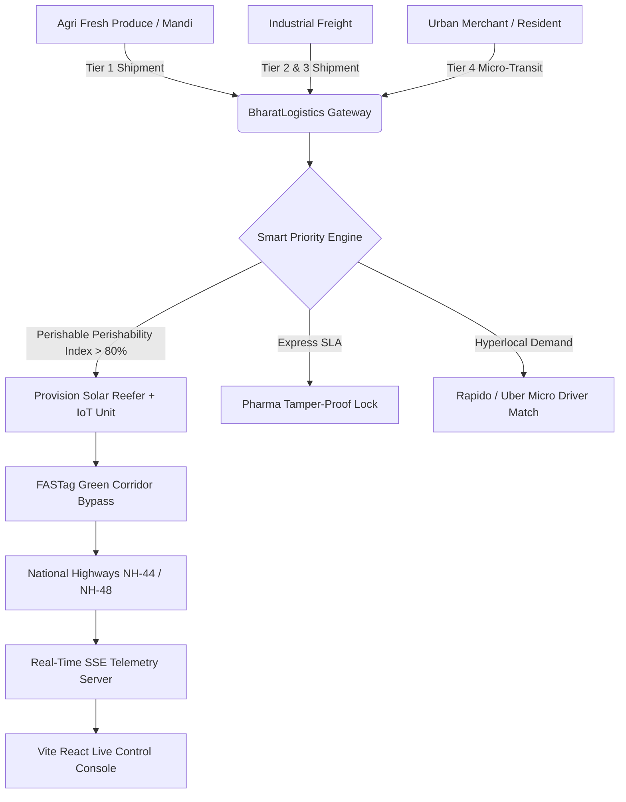

# 🚚 BharatLogistics & AgriFresh IoT
### *Unified Pan-India Supply Chain & Hyperlocal Micro-Transit Platform*

[](https://nodejs.org/)
[](https://react.dev/)
[](https://vitejs.dev/)
[](https://expressjs.com/)
[](#license)

---

## 📌 Executive Summary & Problem Statement

India is one of the world's largest producers of fruits, vegetables, and dairy, yet **over 30% to 40% of agricultural produce is lost annually due to post-harvest cold-chain breakdowns**, inefficient transit routing, and lack of real-time thermal monitoring. 

**BharatLogistics & AgriFresh IoT** resolves this systemic crisis by introducing a **Unified Multi-Tier Supply Chain Architecture across India**. The system enforces a dynamic priority hierarchy — prioritizing high-maintenance perishables on green highway corridors while seamlessly connecting last-mile urban logistics through an on-demand micro-transit dispatch engine.

---

## 🌟 Multi-Tier Logistics Priority Matrix

```
┌───────────────────────────────────────────────────────────────────────────────────┐
│                     PAN-INDIA UNIFIED SUPPLY CHAIN HIERARCHY                       │
└───────────────────────────────────────────────────────────────────────────────────┘
                                         │
        ┌────────────────────────────────┴────────────────────────────────┐
        ▼                                                                 ▼
 ❄️ TIER 1: HIGH PRIORITY (AgriFresh IoT)                📦 TIER 2: HIGH-VALUE EXPRESS
 • Fruits, Veggies, Dairy, Vaccines                      • Pharma, Medicals & High-Tech
 • IoT Reefer: Temp, Humidity, Ethylene ($C_2H_4$)        • GPS Tamper-Proof Smart Seals
 • Arrhenius Freshness Shelf Life Prediction             • Highway Express Clearance
 • FASTag Green Corridor Bypass Pass                     
        │                                                                 │
        └────────────────────────────────┬────────────────────────────────┘
                                         │
        ┌────────────────────────────────┴────────────────────────────────┐
        ▼                                                                 ▼
 🚛 TIER 3: INDUSTRIAL BULK FREIGHT                       ⚡ TIER 4: HYPERLOCAL MICRO-TRANSIT
 • Textiles, FMCG, Grains, Machinery                      • Rapido / Uber / Porter Model
 • Multimodal Rail-Trucking Logistics                    • 2W EV Bikes, 3W E-Cargo, Tata Ace
 • Regional Hub-and-Spoke Intercity                      • Instant Fare & OTP Delivery Handoff
```

### 1. Tier 1 • AgriFresh Perishable IoT (Highest Priority)
* **Commodities**: Ratnagiri Alphonso Mangoes, Shimla Apples, Kolar Tomatoes, Dairy, Biological Vaccines.
* **IoT Telemetry Unit**:
  * **Temperature (°C)**: Sub-zero & cold holding (-20°C to +15°C) with ±0.3°C precision control.
  * **Ethylene Gas ($C_2H_4$) Sensor**: Monitors ripening gas buildup in parts-per-million (ppm). Automatically triggers Nitrogen purge scrubbers.
  * **Relative Humidity (RH %)**: Maintains 85–95% RH to prevent produce moisture loss.
  * **Arrhenius Decay Predictor**: Dynamically calculates remaining shelf life hours:
    $$\text{Decay Rate } k = k_0 \cdot e^{\left(-\frac{E_a}{R \cdot T}\right)} \times \left(1 + \frac{\text{Ethylene}_{\text{ppm}}}{10}\right)$$
  * **Sub-Zero Booster Cooling**: Manual/automated emergency thermal override for highway delays.
* **Green Corridor Clearance**: Automatic FASTag green wave toll bypass on National Highways (NH-44, NH-48, Golden Quadrilateral).

### 2. Tier 2 • High-Value Express Freight
* **Commodities**: Insulin, Medical Diagnostics, Precision Electronics.
* **Security**: Geofence tamper locks, dual battery backup, and express SLA monitoring.

### 3. Tier 3 • Standard Industrial Bulk Cargo
* **Commodities**: Textiles, Grain Bales, Machinery.
* **Infrastructure**: Multimodal rail-road freight corridors across Indian states.

### 4. Tier 4 • Hyperlocal Micro-Transit Engine (Rapido / Uber Model)
* **Vehicle Options**:
  * **2-Wheel EV Bike (Rapido Class)**: Instant small parcel delivery (<25 kg).
  * **3-Wheel E-Cargo Rickshaw**: Urban medium payload (<350 kg).
  * **Tata Ace Mini Truck (Porter Class)**: Commercial last-mile freight (<950 kg).
  * **E-Loader PickUp**: Zero-emission city cargo transport (<600 kg).
* **On-Demand Dispatch**: Instant driver matching, automated fare estimation, and 4-digit OTP delivery handoff verification.

---

## 🛠️ Technology Stack & Architecture

### **Frontend**
* **Framework**: React 19 + Vite 8
* **Styling**: Custom Obsidian Glassmorphic Design System (Vanilla CSS + Tailwind tokens)
* **Mapping**: Leaflet & React-Leaflet with Dark Matter CartoDB tiles & custom SVG marker pins
* **Data Visualization**: Recharts (`AreaChart`, `BarChart`, `PieChart`) for IoT telemetry & ESG food waste analytics
* **Real-Time Integration**: Server-Sent Events (SSE) subscriber client

### **Backend**
* **Runtime**: Node.js v24+
* **Framework**: Express.js
* **Real-time Engine**: SSE (Server-Sent Events) live sensor telemetry ticker (sampling every 3.5s)
* **API Protocol**: RESTful JSON API

---

## 🚀 Quick Start Guide

### Prerequisites
* **Node.js** (v18.0 or higher)
* **npm** (v9.0 or higher)

### Installation & Launch

1. **Clone the Repository**:
   ```bash
   git clone https://github.com/priyanshu-sarjan/Everything.git
   cd Everything
   ```

2. **Install Dependencies**:
   ```bash
   npm install
   ```

3. **Start the Application** (Runs Backend Server & Vite Frontend concurrently):
   ```bash
   npm run dev
   ```

4. **Access the Application**:
   * **Frontend Dashboard**: `http://localhost:3000`
   * **Backend REST API**: `http://localhost:5000/api`

---

## 📡 REST API Documentation

| Method | Endpoint | Description |
| :--- | :--- | :--- |
| `GET` | `/api/shipments` | List all active shipments across Tiers 1–4 with query filters |
| `GET` | `/api/shipments/:id` | Fetch single shipment details with full IoT telemetry |
| `POST` | `/api/shipments` | Dispatch a new national freight shipment (auto-provisions IoT reefer) |
| `POST` | `/api/shipments/:id/booster-cooling` | Trigger instant Sub-Zero Nitrogen Booster Cooling override |
| `GET` | `/api/corridors` | Fetch predefined Indian Logistics Express Corridors (NH-48, NH-44, etc.) |
| `GET` | `/api/micro-vehicles` | Fetch available Rapido/Uber/Porter style drivers by city |
| `POST` | `/api/micro-dispatch` | Request instant hyperlocal vehicle dispatch & generate OTP code |
| `GET` | `/api/analytics` | Fetch national logistics ESG metrics & food waste savings |
| `GET` | `/api/live-stream` | SSE endpoint streaming real-time sensor updates every 3.5 seconds |

---

## 📈 System Architecture & Flow Diagram



---

## 📜 ESG & Environmental Impact SLA Targets

* **99.4% Food Waste Reduction**: Target zero-spoilage transit for high-perishable crops.
* **612.4 Tons CO₂ Offset**: Achieved via EV micro-fleet dispatches & solar-supplemented reefers.
* **-48 Minutes Highway Delay Reduction**: Automated toll green-wave clearances.

---

## 📄 License
Distributed under the MIT License. See `LICENSE` for details.
